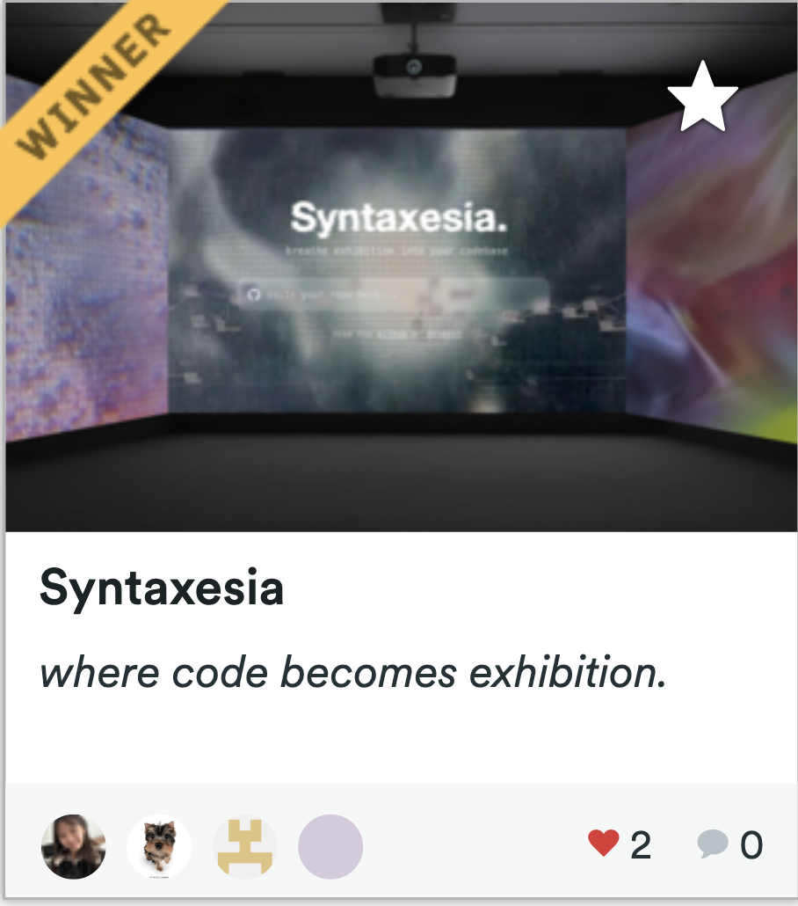
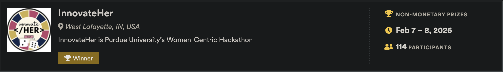

# syntaxesia

watch syntaxesia transform your codespace into an immersive art exhibition in real time. you can also play with an art search engine featuring exclusively female artists. click the gif below for a full demo!
| dubs | intro |
| :---: | :---: |
|  |  |

    
  
    
  
    
  

### search engine example query results

| portrait | textile |
| :---: | :---: |
|  |  |

## about
paste a repo and syntaxesia parses and analyzes structural code signals in your files and converts them into weighted artistic directives: an unique post-modern artwork displayed in a immersive virtual museum. each piece gets a curator-written placard and audio guide. the top floor features a real-time keyword-query search engine for female works from The Met's collection. supports foundational tipping via Solana.

...read more on our [devpost](https://devpost.com/software/syntaxesia)!

## acknowledgements

built with ♡ at innovateher 2026 (1st place winner of art / culture track)

